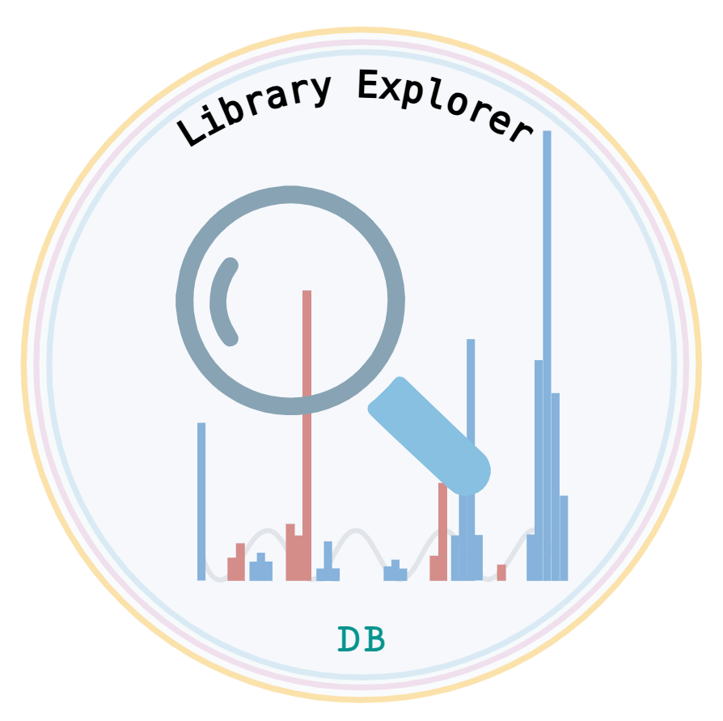

# Library-Explorer
Library Explorer helps DIA proteomics users visualize, explore, and search large libraries. It supports specific protein/peptide searches (including partial matches), peptide extraction, and protein-specific library generation for targeted methods or coverage analysis. Compatible with DIA-NN or Spectronaut libraries, it streamlines workflows.

